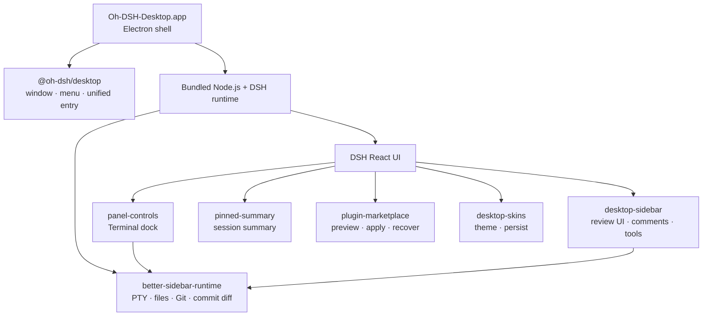

<p align="center">
  <a href="./README.md">简体中文</a> ·
  <strong>English</strong>
</p>

<div align="center">
  
  <h1>Oh-DSH-Desktop</h1>
  <p><strong>DeepSeek Harness, packaged as an installable and extensible desktop workbench.</strong></p>
  <p>
    <a href="#installation">Installation</a> ·
    <a href="#architecture">Architecture</a> ·
    <a href="#bundled-plugins">Bundled Plugins</a> ·
    <a href="#local-build-and-release">Build and Release</a>
  </p>
</div>

<p align="center">
  
  
  
  
  
  
  
</p>

<p align="center">
  
  <br>
  <sub>Main interface, Side Panel, and the Porcelain desktop skin</sub>
</p>

Oh-DSH-Desktop keeps the DSH React UI and packages a pinned DSH runtime,
Node.js, Electron, and local capabilities into a desktop application for
macOS, Linux, and Windows. Models still run in the cloud. The desktop owns the
terminal, workspaces, Git, browser, window integration, and plugin
lifecycle.

It is not a second DSH frontend and requires neither a separate Web Terminal
nor a shell plugin. `@oh-dsh/desktop` is the unified desktop entry while
feature modules retain the official DSH Profile, Loader, locale, settings,
and ThemeService contracts.

## Capabilities

- Self-contained macOS arm64, Linux x64, and Windows x64 applications and installers.
- Multi-tab PTY Terminal, commit/line Review, Browser, and Files.
- Review comments attach to the message composer for direct Agent handling.
- Pinned Summary, expandable Side Panel, and native window controls.
- Plugin marketplace with isolated preview, discard, apply, and recovery.
- Live Chinese/English switching and four original Oh-DSH skins.
- One transaction and approval boundary for human and Agent plugin actions.

## Interface preview

**Plugin marketplace**: browse a public DSH community catalog and preview changes
in an isolated environment.

<p align="center">
  
</p>

**Desktop skins**: switch instantly from DSH Settings, with the selection
persisted by the Host.

<p align="center">
  
</p>

## Installation

### Install a test build

Download from
[GitHub Releases](https://github.com/hust-open-atom-club/oh-dsh-desktop/releases):

- `Oh-DSH-Desktop-0.1.1-arm64.dmg`
- `Oh-DSH-Desktop-0.1.1-arm64.zip`

Open the DMG and drag `Oh-DSH-Desktop.app` into `Applications`. The current
test build has no Developer ID signature or notarization. On first launch,
right-click the application in Finder and choose **Open** if required.

If macOS prevents the DMG from opening, first verify that it was downloaded
from this project's GitHub Release, then remove its quarantine attribute and
open it again. Replace the example DMG path with the file's actual download
path:

```sh
xattr -d com.apple.quarantine ~/Downloads/Oh-DSH-Desktop-0.1.1-arm64.dmg
```

Linux x64 source builds are supported, but the first AppImage / deb release
has not been published yet. It will appear on the same Releases page.

Windows x64 provides an NSIS installer and a portable EXE. Current test builds
are not Authenticode-signed, so first launch may show a SmartScreen warning.

### Run from source

Requirements: Node.js 24+, pnpm 11+, and Git. Release artifacts must be built
on the matching host OS. macOS additionally needs Xcode Command Line Tools;
Linux needs make, g++, and python3.

```sh
git submodule update --init --recursive
pnpm install
pnpm run build:dsh
pnpm start
```

The Better Sidebar Host is pinned as a Git submodule and fetched from a public
HTTPS repository; initializing it requires neither SSH nor GitHub CLI
authentication. The pinned DSH source is acquired separately and can also be
provided through the `DSH_SOURCE` override described below. Published DMG,
ZIP, AppImage, and deb artifacts already contain the compiled output and
require no repository access.

Release builds pin DSH `0.1.0-rc.5` (the npm `0.1.0-rc.6` package is the
publicly published version number of this same code) from the official public
repository at:

```text
47f943859bef60e4160492346772ded9b24f765a
```

The first build stores the source under `.cache/dsh-source/`. Set
`DSH_SOURCE=/absolute/path` to use another checkout; its package version must
still match the pinned version.

Writable runtime state lives at:

```text
macOS  ~/Library/Application Support/Oh-DSH-Desktop/dsh
Linux  ~/.config/Oh-DSH-Desktop/dsh
Windows %APPDATA%\Oh-DSH-Desktop\dsh
```

Configure the DeepSeek API key in DSH Settings or in the `.env` file under
that directory.

## Desktop controls

| Action | Shortcut |
| --- | --- |
| Toggle the DSH left sidebar | `⌘B` |
| Toggle the bottom Terminal | `⌘J` |
| Toggle the Side Panel | `⌥⌘B` |
| Open Review | `⌃⇧G` |
| Open Browser | `⌘T` |
| Open Files | `⌘P` |
| Start a Side chat | `⌥⌘S` |
| Leave Side Panel focus mode | `Esc` |

Opening the Side Panel collapses Pinned Summary and reveals the expand
control. Terminal and Side Panel remain independently toggleable.

## Architecture



`cordis.patch.yml` reuses `dsh-base` and `dsh-web-app`, starts the Web runtime
on a random loopback port, and loads desktop plugins in dependency order.
Third-party plugins remain managed by the DSH Profile and Loader.

## Bundled plugins

| Plugin | Upstream relationship | Oh-DSH adaptation |
| --- | --- | --- |
| `@oh-dsh/desktop` | Original Oh-DSH component | Unified desktop entry, Electron bridge, native menus, windows, Agent capabilities, and bundled plugin order |
| `@oh-dsh/better-sidebar-runtime` | Pinned [`DSH-better-sidebar`](https://github.com/omdsh-dev/DSH-better-sidebar) submodule | Compiles the upstream Host only for PTY, Files, Git, history, and commit diff; the upstream UI is not loaded |
| `@oh-dsh/panel-controls` | Downstream reimplementation of the early dsh-web-panel interaction model | Keeps the Oh-DSH Terminal dock, themes, localization, and Session state on the shared PTY Host; no separate Web Terminal installation |
| `@oh-dsh/pinned-summary` | Original Oh-DSH component | Active Session summary, half-height card, and conversation gutter |
| `@oh-dsh/desktop-sidebar` | Oh-DSH UI downstream of [`DSH-better-sidebar`](https://github.com/omdsh-dev/DSH-better-sidebar) | Uses the shared Host for Session tabs, viewers, Files, Git Review, line comments, and Agent composer references while retaining the current layout, icons, and themes |
| `@oh-dsh/plugin-marketplace` | Supports [`plugin-registry`](https://github.com/vlln/plugin-registry), [`dsh-hub`](https://github.com/omdsh-dev/dsh-hub), and the public [`dsh-suite`](https://github.com/whyihaveyou/dsh-suite) catalog | Unifies isolated preview, risk review, TOFU source locks, apply, and recovery with desktop navigation and bilingual UI |
| `@oh-dsh/desktop-skins` | Downstream reimplementation of the early dsh-skins ThemeService extension model | Retains the ThemeService extension model but redesigns skins, Settings UI, and Host persistence |

Plugins marked as downstream adaptations or distilled designs are reviewed
against upstream releases and features regularly. Compatible features are
ported through the current DSH contracts; syncing does not overwrite Oh-DSH
UI, themes, or desktop interactions.

See [THIRD_PARTY_NOTICES.md](./THIRD_PARTY_NOTICES.md) for source and license
details.

## Plugin marketplace

The **Plugins** page defaults to the public
`whyihaveyou/dsh-suite/data/plugins.json` catalog and preserves each entry's
canonical `owner/repo` identity. Install, update, enable, disable, and
uninstall operations first create an isolated candidate Profile:

```text
verify the source and exact commit
        ↓
install and launch an isolated preview Profile
        ↓
discard (live desktop unchanged) or apply (retain previous)
        ↓
Undo restores the previous Profile when needed
```

The Agent can enter the same workflow through conversation. Apply and recover
still require human approval and cannot bypass preview or introduce a second
DSH Loader. Private repositories authenticate through GitHub CLI:

```sh
gh auth login
```

Set `OH_DSH_MARKETPLACE_CATALOG=owner/repository/path/to/catalog.json` to use
a compatible `dsh-external-hub/v0.1`, `omdsh-registry/v1`, or `dsh-suite` 1.0
catalog.

## Security boundaries

- DSH Web runtime and Agent management bind only to random loopback ports.
- Browser uses an isolated Electron partition without Node.js or preload.
- The Better Sidebar Host enforces Session and Workspace bounds for Files and Git.
- Marketplace candidates pin Git commits, block install scripts by default,
  and leave the live Profile unchanged until apply.
- The pnpm release-age policy stays enabled, excluding only `@deepseek-ai/*`.

## Local build and release

A complete build rebuilds the pinned DSH source. Use the quick build when the
cache is already current:

```sh
pnpm run dist:mac
pnpm run dist:linux
# or
pnpm run dist:mac:quick
pnpm run dist:linux:quick
```

macOS artifacts are written to `release/`:

```text
release/
├── Oh-DSH-Desktop-0.1.1-arm64.dmg
├── Oh-DSH-Desktop-0.1.1-arm64.zip
└── mac-arm64/Oh-DSH-Desktop.app
```

Linux artifacts are written to the same directory:

```text
release/
├── Oh-DSH-Desktop-0.1.1-x86_64.AppImage
├── Oh-DSH-Desktop-0.1.1-amd64.deb
└── linux-unpacked/oh-dsh-desktop
```

Windows artifacts:

```text
release/
├── Oh-DSH-Desktop-0.1.1-windows-x64-setup.exe
├── Oh-DSH-Desktop-0.1.1-windows-x64-portable.exe
└── win-unpacked/Oh-DSH-Desktop.exe
```

The bundled Node runtime defaults to the build machine's platform. Set
`DSH_DESKTOP_NODE_PLATFORM` (`linux`/`darwin`/`win`) and `DSH_DESKTOP_NODE_ARCH`
(`x64`/`arm64`) to stage a different target for cross-packaging.

The `Native release builds` GitHub Actions workflow builds on native Linux and
Windows runners, exercises DSH, the plugin graph, Git/Workspace, the PTY
Terminal, and packaged app startup, and validates Windows install/uninstall
plus portable startup. It uploads workflow artifacts without publishing a
GitHub Release.

Verify on the matching host before upload:

```sh
pnpm run typecheck
pnpm test
pnpm run dist:mac
pnpm run smoke:app
codesign --verify --deep --strict \
  release/mac-arm64/Oh-DSH-Desktop.app
hdiutil verify release/Oh-DSH-Desktop-0.1.1-arm64.dmg
```

On Linux, verify with:

```sh
pnpm run typecheck
pnpm test
pnpm run dist:linux
pnpm run smoke:app:linux
```

On Windows, verify with:

```powershell
pnpm run typecheck
pnpm test
pnpm run dist:win
pnpm run smoke:app:win
```

CI creates unsigned Windows test packages by default. For release signing,
provide `CSC_LINK` and `CSC_KEY_PASSWORD` through CI secrets as required by
electron-builder; never commit the certificate.

The package metadata, download instructions, and public release now all use
`v0.1.1`. For the next release, update every workspace package first, then use
that same version for the tag and Release.

```sh
gh release create vNEXT \
  release/Oh-DSH-Desktop-NEXT-arm64.dmg \
  release/Oh-DSH-Desktop-NEXT-arm64.zip \
  release/Oh-DSH-Desktop-NEXT-x86_64.AppImage \
  release/Oh-DSH-Desktop-NEXT-amd64.deb \
  --title "Oh-DSH-Desktop NEXT" \
  --generate-notes
```

## License

[BSD 3-Clause](./LICENSE)
