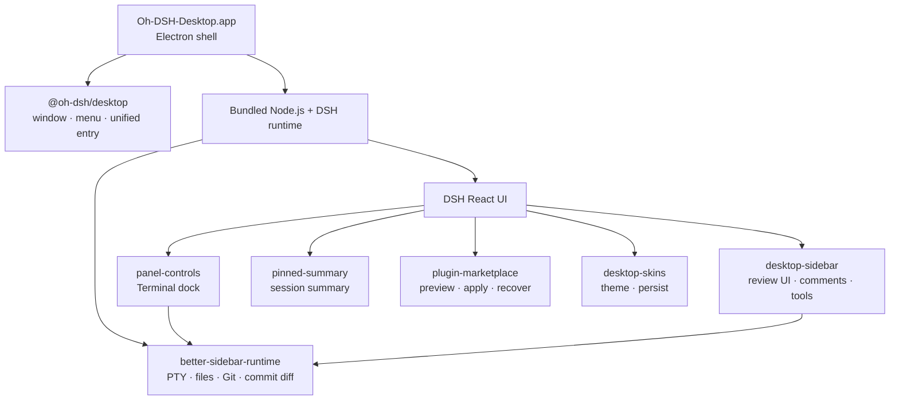

<p align="center">
  <strong>简体中文</strong> ·
  <a href="./README.en.md">English</a>
</p>

<div align="center">
  
  <h1>Oh-DSH-Desktop</h1>
  <p><strong>把 DeepSeek Harness 装进一个可安装、可扩展的桌面工作台。</strong></p>
  <p>
    <a href="#安装">安装</a> ·
    <a href="#架构">架构</a> ·
    <a href="#内置-plugins">内置 Plugins</a> ·
    <a href="#本地构建与发布">构建与发布</a>
  </p>
</div>

<p align="center">
  
  
  
  
  
  
  
</p>

<p align="center">
  
  <br>
  <sub>主界面、Side Panel 与 Porcelain 桌面皮肤</sub>
</p>

Oh-DSH-Desktop 保留 DSH React UI，把固定版本的 DSH runtime、Node.js、
Electron 和本地能力打包进 macOS、Linux 与 Windows 应用。模型仍运行在云端，桌面端负责
终端、Workspace、Git、浏览器、窗口集成和 plugin 生命周期。

它不是另一套 DSH 前端，也不需要额外安装 Web Terminal 或 shell plugin。
`@oh-dsh/desktop` 提供统一桌面入口，功能模块继续沿用 DSH 官方的 Profile、
Loader、locale、settings 和 ThemeService 契约。

## 主要能力

- 自包含的 macOS arm64、Linux x64 与 Windows x64 应用及安装包。
- 多标签 PTY Terminal、逐提交/逐行 Review、Browser 和 Files。
- Review 评论可汇总进消息输入框，直接交给 Agent 处理。
- Pinned Summary、可展开 Side Panel 与原生窗口控制。
- 支持隔离预览、放弃、应用和恢复的插件市场。
- 中英文实时切换，以及四套 Oh-DSH 自有桌面皮肤。
- 人类 UI 与 Agent 共用同一套插件安装事务和审批边界。

## 界面预览

**插件市场**：浏览公共 DSH 社区目录，并在隔离环境中预览变更。

<p align="center">
  
</p>

**桌面皮肤**：在 DSH 设置页即时切换，由 Host 持久化选择。

<p align="center">
  
</p>

## 安装

### 安装测试包

从 [GitHub Releases](https://github.com/hust-open-atom-club/oh-dsh-desktop/releases)
下载：

- `Oh-DSH-Desktop-0.1.1-arm64.dmg`
- `Oh-DSH-Desktop-0.1.1-arm64.zip`

打开 DMG，把 `Oh-DSH-Desktop.app` 拖入 `Applications`。当前测试包没有
Developer ID 和 notarization，首次启动时可在 Finder 中右键应用并选择
“打开”。

如果 macOS 阻止打开 DMG，请先确认文件下载自本项目的 GitHub Release，
再移除该 DMG 的 quarantine 属性并重新打开。请将示例中的 DMG 路径替换为
文件的实际下载路径：

```sh
xattr -d com.apple.quarantine ~/Downloads/Oh-DSH-Desktop-0.1.1-arm64.dmg
```

#### Linux

Linux x64 已支持从源码构建；首个 AppImage / deb 尚未发布。发布后会出现在
[GitHub Releases](https://github.com/hust-open-atom-club/oh-dsh-desktop/releases)。
Linux 运行数据位于 `~/.config/Oh-DSH-Desktop/dsh`，DeepSeek API key 可以
在 DSH 设置页配置，也可以写入该目录下的 `.env`。

#### Windows

Windows x64 提供 NSIS 安装器和免安装 portable EXE；日常使用推荐安装器。
portable 每次启动都需要先解压内置运行时，期间会显示准备画面，可能需要几分钟，
请勿重复运行。当前测试包未进行 Authenticode 签名，首次启动可能显示 SmartScreen 提示。

### 从源码运行

要求 Node.js 24+、pnpm 11+ 和 Git；发行包必须在对应宿主系统上构建。
macOS 还需要 Xcode Command Line Tools，Linux 需要 make、g++ 和 python3。

```sh
git submodule update --init --recursive
pnpm install
pnpm run build:dsh
pnpm start
```

Better Sidebar Host 以固定 Git submodule 跟踪，并通过公开 HTTPS 仓库获取；
初始化该 submodule 不需要 SSH 或 GitHub CLI 认证。固定的 DSH 源码单独获取，
也可以通过下述 `DSH_SOURCE` 指向已有 checkout。已发布的 DMG、ZIP、AppImage
和 deb 已包含编译产物，不需要仓库权限。

发行构建固定使用 DSH `0.1.0-rc.5`（npm 上的 `0.1.0-rc.6` 即同一份代码的
公开发布版本号），源码来自官方公共仓库：

```text
47f943859bef60e4160492346772ded9b24f765a
```

首次构建会把源码放进 `.cache/dsh-source/`。如需使用另一个 checkout，可设置
`DSH_SOURCE=/absolute/path`，但 package version 必须与固定版本一致。

运行数据位于：

```text
macOS  ~/Library/Application Support/Oh-DSH-Desktop/dsh
Linux  ~/.config/Oh-DSH-Desktop/dsh
Windows %APPDATA%\Oh-DSH-Desktop\dsh
```

DeepSeek API key 可以在 DSH 设置页配置，也可以写入该目录下的 `.env`。

## 常用操作

| 操作 | 快捷键 |
| --- | --- |
| 切换 DSH 左侧栏 | `⌘B` |
| 切换底部 Terminal | `⌘J` |
| 切换 Side Panel | `⌥⌘B` |
| 打开 Review | `⌃⇧G` |
| 打开 Browser | `⌘T` |
| 打开 Files | `⌘P` |
| 新建 Side chat | `⌥⌘S` |
| 退出 Side Panel 专注模式 | `Esc` |

Side Panel 打开时会收起 Pinned Summary，并显示全屏展开按钮。Terminal 与
Side Panel 可以独立开关。

## 架构



`cordis.patch.yml` 复用 `dsh-base` 与 `dsh-web-app`，在随机 loopback 端口
启动 Web runtime，再按依赖顺序加载桌面 plugins。第三方插件仍由 DSH
Profile 和 Loader 管理。

## 内置 plugins

| Plugin | 来源关系 | Oh-DSH 改造 |
| --- | --- | --- |
| `@oh-dsh/desktop` | Oh-DSH 自研 | 统一桌面入口、Electron bridge、原生菜单、窗口、Agent 能力与内置 plugin 注册顺序 |
| `@oh-dsh/better-sidebar-runtime` | 固定跟踪 [`DSH-better-sidebar`](https://github.com/omdsh-dev/DSH-better-sidebar) submodule | 仅编译上游 Host，提供 PTY、Files、Git、history 和 commit diff；不加载上游 UI |
| `@oh-dsh/panel-controls` | 对早期 dsh-web-panel 交互模型的下游重实现 | 保留 Oh-DSH Terminal dock、主题、双语和 Session 状态，复用统一 PTY Host；不再安装独立 Web Terminal |
| `@oh-dsh/pinned-summary` | Oh-DSH 自研 | 当前 Session 摘要、半高卡片和正文 gutter 管理 |
| `@oh-dsh/desktop-sidebar` | [`DSH-better-sidebar`](https://github.com/omdsh-dev/DSH-better-sidebar) 的 Oh-DSH UI 下游 | 复用统一 Host，提供 Session tabs、viewer、Files、Git Review、逐行评论和 Agent composer 引用，保留现有布局、图标与主题 |
| `@oh-dsh/plugin-marketplace` | 兼容 [`plugin-registry`](https://github.com/vlln/plugin-registry)、[`dsh-hub`](https://github.com/omdsh-dev/dsh-hub) 与公共 [`dsh-suite`](https://github.com/whyihaveyou/dsh-suite) 目录 | 统一隔离预览、风险确认、TOFU 来源锁、应用与恢复流程，并适配桌面导航和双语 UI |
| `@oh-dsh/desktop-skins` | 对早期 dsh-skins ThemeService 扩展模型的下游重实现 | 沿用 ThemeService 扩展思路，重做皮肤、设置 UI 和 Host 持久化 |

标记为“下游改造”或“炼化”的 plugin 会定期检查上游 release 和 feature，选择
与当前 DSH 契约兼容的能力同步。同步以 feature 为单位重新适配，不直接覆盖
Oh-DSH 的 UI、主题和桌面交互。

更完整的来源与许可证说明见
[THIRD_PARTY_NOTICES.md](./THIRD_PARTY_NOTICES.md)。

## 插件市场

左侧 **Plugins** 页面默认读取公开的 `whyihaveyou/dsh-suite/data/plugins.json`
目录，并保留条目中的规范 `owner/repo` 身份。安装、更新、启用、停用和卸载
都会先生成隔离 candidate Profile：

```text
检查来源与精确 commit
        ↓
在隔离 Profile 中安装并启动预览
        ↓
放弃（当前桌面不变）或应用（保留 previous）
        ↓
需要时 Undo 恢复上一份 Profile
```

Agent 也可以通过对话进入同一流程。应用和恢复仍需要人类审批，不能绕过预览
或启动第二套 DSH Loader。私有仓库认证使用 GitHub CLI：

```sh
gh auth login
```

可通过 `OH_DSH_MARKETPLACE_CATALOG=owner/repository/path/to/catalog.json`
切换到兼容的 `dsh-external-hub/v0.1`、`omdsh-registry/v1` 或
`dsh-suite` 1.0 目录。

## 安全边界

- DSH Web runtime 与 Agent 管理通道只监听随机 loopback 端口。
- Browser 使用独立 Electron partition，不注入 Node.js 或 preload。
- Better Sidebar Host 对 Files 和 Git 请求执行 Session 与 Workspace 边界校验。
- 市场固定 Git commit，默认阻止安装脚本，应用前不修改当前 Profile。
- pnpm release-age 策略保持启用，只排除 `@deepseek-ai/*`。

## 本地构建与发布

完整构建会重建固定 DSH；缓存已经就绪时可使用 quick 构建：

```sh
pnpm run dist:mac
pnpm run dist:linux
# 或
pnpm run dist:mac:quick
pnpm run dist:linux:quick
```

macOS 产物位于 `release/`：

```text
release/
├── Oh-DSH-Desktop-0.1.1-arm64.dmg
├── Oh-DSH-Desktop-0.1.1-arm64.zip
└── mac-arm64/Oh-DSH-Desktop.app
```

Linux 产物同样位于 `release/`：

```text
release/
├── Oh-DSH-Desktop-0.1.1-x86_64.AppImage
├── Oh-DSH-Desktop-0.1.1-amd64.deb
└── linux-unpacked/oh-dsh-desktop
```

Windows 产物：

```text
release/
├── Oh-DSH-Desktop-0.1.1-windows-x64-setup.exe
├── Oh-DSH-Desktop-0.1.1-windows-x64-portable.exe
└── win-unpacked/Oh-DSH-Desktop.exe
```

打包内置的 Node runtime 默认匹配构建机平台；跨平台打包可显式指定
`DSH_DESKTOP_NODE_PLATFORM`（`linux`/`darwin`/`win`）与 `DSH_DESKTOP_NODE_ARCH`
（`x64`/`arm64`）。

`Native release builds` GitHub Actions 会在 Linux/Windows 原生 runner 上
生成发行包，执行 DSH、插件图、Git/Workspace、PTY Terminal 和 packaged
app 冒烟，并验证 Windows 安装/卸载与 portable 启动。产物作为 workflow
artifacts 上传，不会自动发布 GitHub Release。

上传前在对应宿主验证：

```sh
pnpm run typecheck
pnpm test
pnpm run dist:mac
pnpm run smoke:app
codesign --verify --deep --strict \
  release/mac-arm64/Oh-DSH-Desktop.app
hdiutil verify release/Oh-DSH-Desktop-0.1.1-arm64.dmg
```

Linux 上对应验证：

```sh
pnpm run typecheck
pnpm test
pnpm run dist:linux
pnpm run smoke:app:linux
```

Windows 上对应验证：

```powershell
pnpm run typecheck
pnpm test
pnpm run dist:win
pnpm run smoke:app:win
```

CI 默认生成未签名 Windows 测试包。发布签名时按 electron-builder 约定通过
CI secret 提供 `CSC_LINK` 与 `CSC_KEY_PASSWORD`，证书不可提交到仓库。

当前 package、下载说明和公开 Release 均为 `v0.1.1`。准备下一个版本时，
先统一更新 workspace package 版本，再使用同一版本创建 tag 与 Release：

```sh
gh release create vNEXT \
  release/Oh-DSH-Desktop-NEXT-arm64.dmg \
  release/Oh-DSH-Desktop-NEXT-arm64.zip \
  release/Oh-DSH-Desktop-NEXT-x86_64.AppImage \
  release/Oh-DSH-Desktop-NEXT-amd64.deb \
  --title "Oh-DSH-Desktop NEXT" \
  --generate-notes
```

## License

[BSD 3-Clause](./LICENSE)
