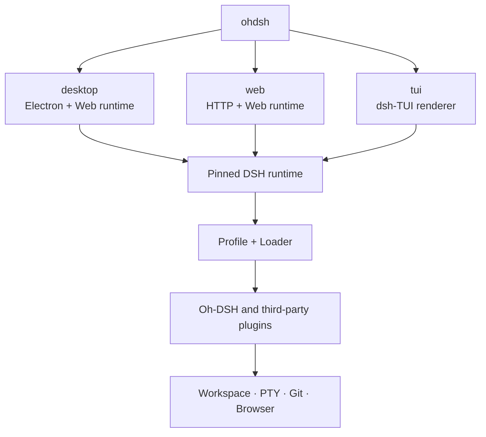
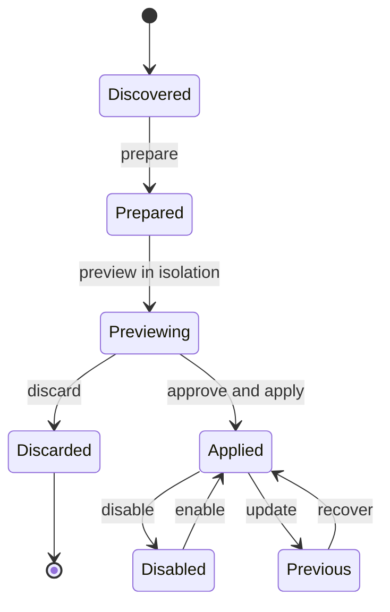

# Oh-DSH design and plugin boundaries

English | [中文](design.zh.md)

## Goals

Oh-DSH provides Desktop, Web, and TUI over one pinned DSH runtime.
The surfaces share sessions, Profiles, plugin contracts, and local
capabilities, while each package carries only the interaction layer it needs.
Lightweight deployments do not have to install Electron.

Design principles:

- Reuse DSH Profile, Loader, locale, settings, and ThemeService contracts.
- Desktop is the full distribution; Web and TUI can be packaged separately.
- Keep one Host and one permission boundary for each capability.
- Human and Agent plugin actions share the same preview and commit transaction.
- Synchronize upstream features without replacing the Oh-DSH UI or themes.

## Surface architecture

`ohdsh` only selects an interaction surface. Runtime capabilities remain
under DSH Profile and Loader management, so separate packages never create a
second plugin system.

## Distribution boundaries

| Package | Includes | Excludes |
| --- | --- | --- |
| Full/Desktop | Electron, Web runtime, TUI, Node, bundled plugins, unified CLI | Nothing |
| Web-only | HTTP/Web runtime, Node, Web-compatible plugins, unified CLI | Electron and native window features |
| TUI-only | dsh-TUI renderer, Node, TUI-compatible plugins, unified CLI | Electron and browser UI |

Desktop itself uses the Web UI, so Oh-DSH does not ship a degraded
"Desktop-only" package. Web-only and TUI-only remove Electron; TUI-only is
the smallest supported distribution.

## Bundled plugins and upstreams

| Plugin | Relationship | Oh-DSH boundary |
| --- | --- | --- |
| `@oh-dsh/desktop` | Native | Unified entry, window, menu, bridge, and bundled-plugin registration |
| `@oh-dsh/better-sidebar-runtime` | Pins [`DSH-better-sidebar`](https://github.com/omdsh-dev/DSH-better-sidebar) | Builds the upstream Host for PTY, Files, Git, history, and commit diff |
| `@oh-dsh/sidebar` | Downstream Better Sidebar UI adapter | Reuses the Host while retaining Oh-DSH layout, icons, themes, Review, and comments |
| `@oh-dsh/panel-controls` | Downstream implementation of the `dsh-web-panel` interaction model | Unified Terminal dock without a separate Web Terminal install |
| `@oh-dsh/pinned-summary` | Native | Session summary, half-height card, and content-gutter management |
| `@oh-dsh/plugin-marketplace` | Adopts lifecycle ideas from `plugin-registry` and `dsh-hub` | One Loader, isolated preview, risk approval, TOFU source lock, and recovery |
| `@oh-dsh/skins` | Downstream implementation of the `dsh-skins` ThemeService model | One skin id set, Host persistence, Web/Desktop CSS, and TUI palette adapters |
| `@deepseek-harness-tui/dsh-tui` | Pins [`dsh-TUI`](https://github.com/ccch1mneyyy/dsh-TUI) | Upstream owns terminal rendering, session interaction, commands, extension seams, and terminal compatibility |
| `@oh-dsh/tui` | Downstream Profile adapter for `dsh-TUI` | Unified `ohdsh tui`, Oh-DSH TUI identity, defaults, packaging, and DSH data boundary |

Downstream plugins periodically inspect upstream features and adapt them to
the current DSH contracts. Upstream code, the Oh-DSH UI, and final permission
boundaries remain separate layers.

`@oh-dsh/skins` is the only skin-definition module for all three surfaces.
Web and Desktop adapt the catalog to DSH CSS tokens; TUI adapts the same ids
to the upstream native `/theme` palettes. TUI retains upstream hot switching
and its picker, then mirrors the choice into the shared `skins.json` on the
next launch. There is no second theme loader.

## Plugin installation transaction

`installed` and `enabled` are separate states. Installation and updates pin
the source and commit before entering an isolated preview. Only explicit
application changes the current Profile. Agent-initiated installs use the
same transaction and risk approval and cannot bypass the Loader.

## Security boundaries

- Web binds to loopback by default; LAN exposure requires trusted authorities.
- Files, PTY, and Git requests are bound to the active Session and Workspace.
- Local `view_image` reads are bound to the active Session workspace.
- Desktop/Web image paste, thumbnails, and submission remain owned by DSH's
  attachment store and native attachment rail; natively multimodal models
  such as DeepSeek V4 Flash consume the attachments directly (the former
  `@oh-dsh/vision` bridge plugin is removed).
- Marketplace candidate, current, and previous states remain separate.
- A source receives a TOFU lock on first use; later commit changes need review.
- The Electron bridge exists only on Desktop; Web does not emulate its rights.
- TUI starts only on a real TTY and retains the active DSH Profile's sandbox
  and approval policies.

## Naming and data root

User-facing names are **Oh-DSH Desktop**, **Oh-DSH Web**, and **Oh-DSH TUI**.
Internal package ids and the bundle id remain stable. All three surfaces use
`~/.ohdsh`, keep their compositions in separate Profiles, and share sessions,
credentials, skins, and plugin caches. `OH_DSH_HOME` is the common override;
the Web and TUI `--data` flags override only the current process.

See [installation, operations, and troubleshooting](./usage.md).
